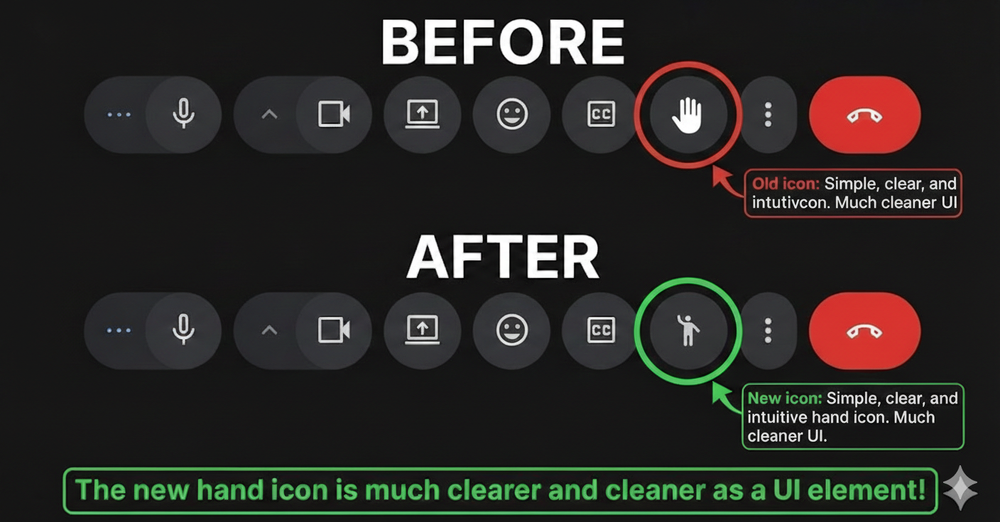

# Meet Raise Hand Clarifier

Chrome extension that replaces Google Meet's ambiguous hand icon with a clear "raise hand" person icon.

## Before vs After

## Install

1. Open `chrome://extensions`.
2. Enable **Developer mode**.
3. Click **Load unpacked**.
4. Select this folder: `/home/c10r/workspace/gmeet-no-hands`.

## Verify

1. Join any Google Meet call.
2. Look at the bottom control bar.
3. The **Raise hand** button icon should show a person-with-raised-hand style symbol.

## Notes

- The script targets buttons whose `aria-label` starts with `Raise hand`.
- If Google changes Meet's DOM, this extension may need a selector update.
